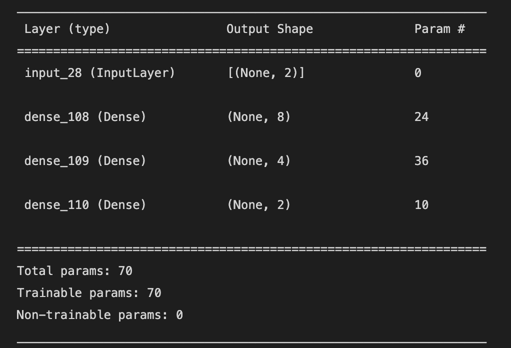
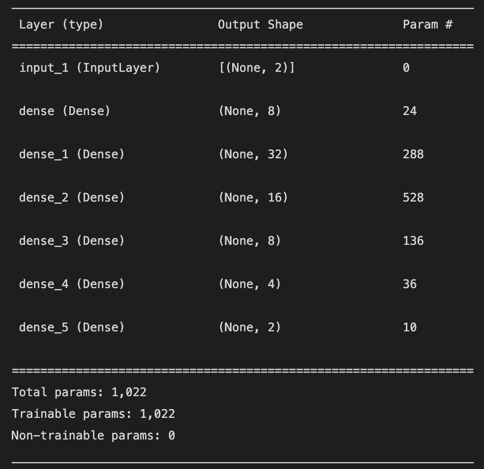
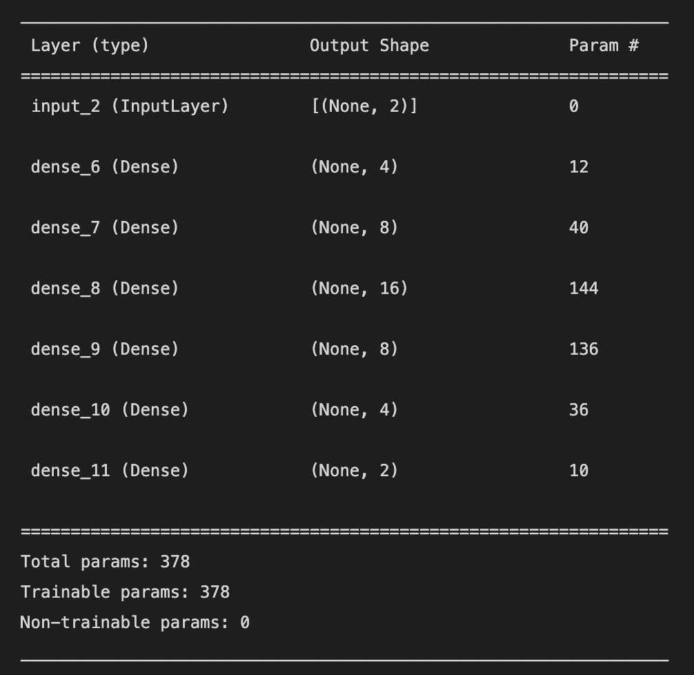

### == Q1 ==
__Revisa la documentación de tensorflow: ¿qué tipo de activación tiene la capa de salida de la red que acabamos de crear?__

R= Activación lineal

### == Q2 ==
__Según la documentación de tensorflow (y/o el código de la siguiente celda), ¿Qué extructura de datos usa tensorflow para organizar las capas de una red?__

R= Tensores

### == Q3 ==
__En el ejercicio anterior le indicamos a tensorflow que separara 20% de los datos de entrenamiento para hacer validación. Dicho 20% es seleccionado de manera aleatoria. Revisa la documentación de la función .fit() para saber cómo puedes darle un subset de validación que no cambie entre diferentes corridas de entrenamiento. Reporta tu respuesta.__

R= Con el argumento __validation_data__ y eliminando el argumento __validation_split__.

### == Q4 == 
__Nota que esta segunda red, aunque más grande, parece generar peores resultados en comparación con la primera red. Encuentra la mejor combinación de hiperparámetros para minimizar el error tanto como sea posible. Reporta: número de capas, número de perceptrones en cada capa, número total de pesos, tamaño del lote, y número de épocas.__

Se crearon 3 combinaciones de red. Se reporta a continuación la información solicitada para las arquitecturas creadas y para los mejores modelos:

#### Modelo 1 [2, 32, 16, 8, 4, 2]:

```{r, echo=FALSE, out.width="60%", fig.cap="A nice image."}

```

Mejores resultados:

1) [2, 32, 16, 8, 4, 2]; batch_size=4, epochs=200, validation_split=0.2 -> Average --  train loss: 4.8648 +- 3.4672;  test loss: 5.2218 +- 4.2117
2) [2, 32, 16, 8, 4, 2]; batch_size=4, epochs=200, validation_split=0.1 -> Average --  train loss: 4.6441 +- 3.5963;  test loss: 4.9694 +- 4.3508
3) [2, 32, 16, 8, 4, 2]; batch_size=2, epochs=200, validation_split=0.1 -> Average --  train loss: 3.6965 +- 4.1280;  test loss: 4.1307 +- 4.7731

\newpage

#### Modelo 2: [2, 8, 32, 16, 8, 4, 2]

```{r, echo=FALSE, out.width="60%", fig.cap="A nice image."}

```

Mejores resultados:

- [2, 8, 32, 16, 8, 4, 2]; batch_size=4, epochs=200, validation_split=0.2 -> Average --  train loss: 4.6602 +- 3.3445;  test loss: 4.9514 +- 4.0859

\newpage
#### Modelo 3: [2, 4, 8, 16, 8, 4, 2]

{width=60%}
   
Mejores resultados: 

- [2, 4, 8, 16, 8, 4, 2]; batch_size=4, epochs=200, validation_split=0.2 -> Average --  train loss: 5.3751 +- 3.3875;  test loss: 5.8204 +- 4.1399


### == Q5 ==
__De acuerdo con los resultados obtenidos después de correr el modelo 100 veces, ¿pareciera que el modelo es confiables/estable? ¿por qué si o por qué no?__

R= No pareciera ser confiable porque los errores son muy pequeños o muy grandes según el conjunto de datos usado para el entrenamiento y la validación. 
