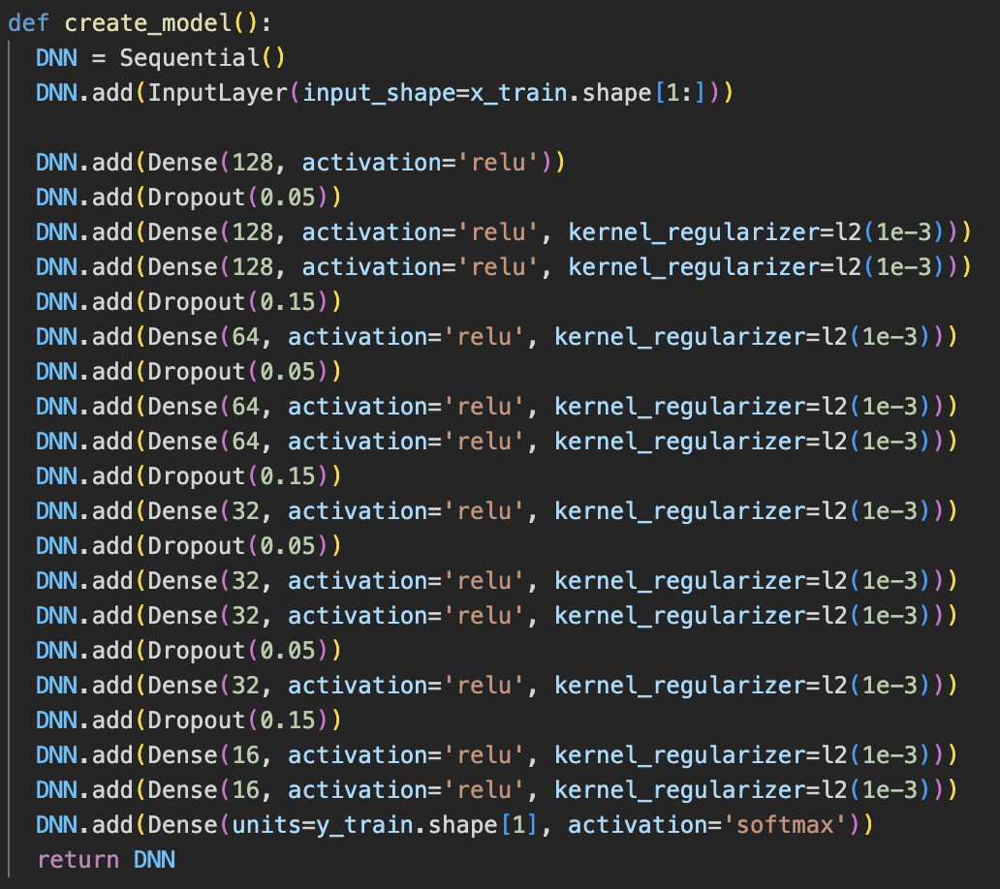
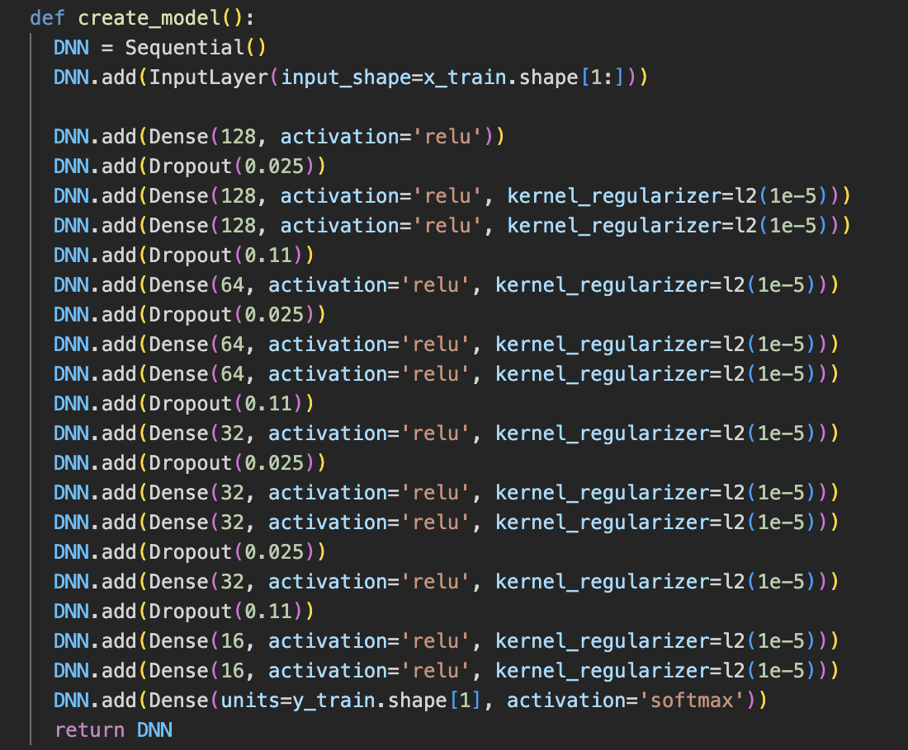

```{r include=FALSE}
library(knitr)
library(ggplot2)
```

### == Q1 ==
__Revisa la documentación de la función `to_categorical()` para entender por qué indicamos 8 clases en nuestra conversión. Reporta tu respuesta.__

R= La función `to_cagetorical()` espera como parámetro un vector numérico con valores entre 0 y `num_classes - 1`, lo que implica que si nosotros ponemos como parámetro `num_classes = 8` entonces la función intentará convertir a matriz desde 0 hasta `num_classes - 1 = 8 - 1 = 7`, de esta manera nos aseguramos de que todos los valores que toma el vector son codificados. En cambio, si pusiéramos `num_classes = 7`, entonces la codificación se hace desde 0 hasta `num_classes - 1 = 7 - 1 = 6`, dejando de lado la clase con valor de 7.0 y causando un error.

### == Q2 ==
__¿Por qué usamos softmax en la salida de la red?__

R= Softmax es una función de activación usada en problemas de clasificación multiclase debido a que funciona como un normalizador de probabilidades, lo que permite denotar cuál es la clase más probable a la salida para un vector de información a la entrada.

### == Q3 ==
__Ajusta el primer modelo (sin regularizadores) para obtener una pérdida de "entrenamiento" menor o igual a 0.08 y exactitud mayor o igual a 98%. Reporta el número de capas, número de unidades en cada capa, y número de parámetros.__

Se logró con un entrenamiento de 1000 épocas con tamaño de batch de 256.

```{r echo=FALSE, out.width = "55%", fig.pos="H", fig.cap="Arquitectura modelo 1.", fig.align="center"}

```


```{r echo=FALSE, out.width = "90%", fig.pos="H", fig.cap="Gráficas de pérdida y accuracy modelo 1.", fig.align="center"}

```

### == Q4 ==

Ahora usa esos mismos valores de hiperparámetros (número de capas y unidades) en el siguiente modelo, y añade capas dropout (ajusta sus tasa), capas batchnorm, y regularizadores l1 o l2 (ajusta sus alfas) para disminuir el error de generalización. Reporta el modelo regularizado que te haya dado mejores resultados.

```{r echo=FALSE, out.width = "55%", fig.pos="H", fig.cap="Arquitectura modelo 2.", fig.align="center"}

```


```{r echo=FALSE, out.width = "90%", fig.pos="H", fig.cap="Gráficas de pérdida y accuracy modelo 2.", fig.align="center"}

```

### == Q5 ==

Partiendo del mejor modelo que hayas obtenido anteriormente, modifica el número de sus capas y unidades para disminuir aún más los errores, tanto el de entrenamiento como el de validación (i.e., dale mayor capacidad). Reporta tu mejor modelo.

```{r echo=FALSE, out.width = "55%", fig.pos="H", fig.cap="Arquitectura modelo 3.", fig.align="center"}

```


```{r echo=FALSE, out.width = "90%", fig.pos="H", fig.cap="Gráficas de pérdida y accuracy modelo 3.", fig.align="center"}

```

### == Q6 ==
__En el compilado del modelo usamos `categorical_accuracy` como métrica de monitoreo. Revisa la documentación de tensorflow, y explica la diferencia entre las métricas `accuracy`, `binary_accuracy`, y `categorical_accuracy`.__

`binary_accuracy` mide la cantidad de veces que las predicciones son iguales a las clases en un problema de clasificación binaria. `accuracy` mide la cantidad de veces que las predicciones son iguales a las clases numéricas en un problema de clasificación para una sola variable de salida pero que toma distintos valores numéricos. `categorical_accuracy` mide la cantidad de veces que las predicciones son iguales a las clases one-hot encoding. 
